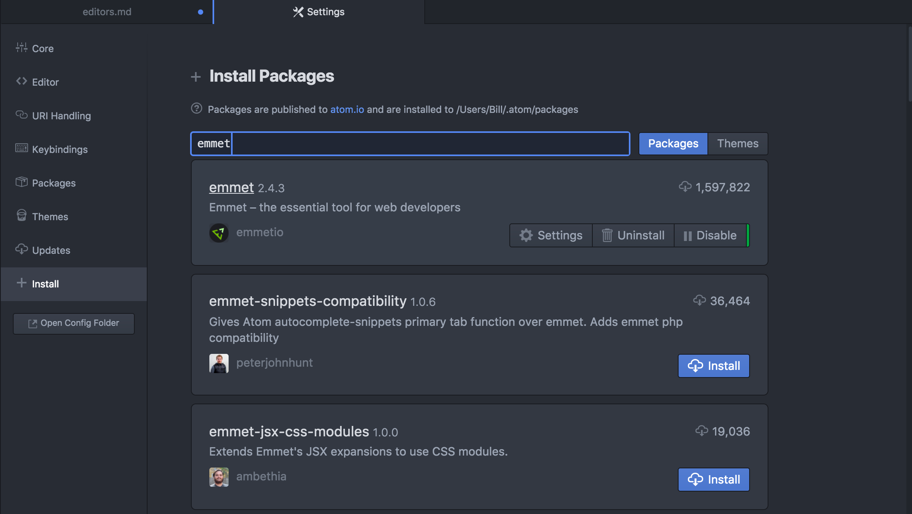
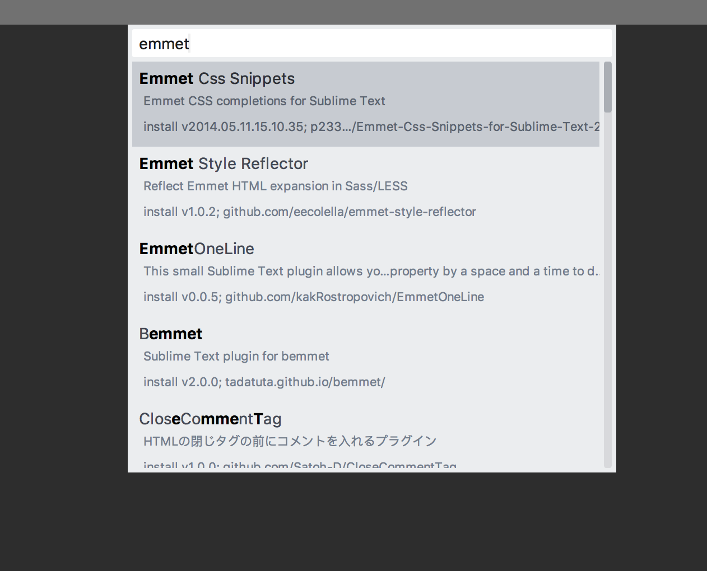

## Text Editors
You will need a text editor to actually write some code. They can all pretty much
do everything you need, so the editor that you choose is really down to personal
preference.

Nice article explaining the pro's and con's: https://www.codementor.io/mattgoldspink/best-text-editor-atom-sublime-vim-visual-studio-code-du10872i7

We would recommend one of the following (these are the editors the mentors know best and so will be able to help with the most):
- [Visual Studio Code](#visual-studio-code)
- [Atom](#atom)
- [Sublime Text](#sublime-text)

## Packages
Packages extend the functionality of your editor. If you can think of it chances are it already exists as a package for the editor.

We would recommend:
- [Emmet](https://emmet.io/)
- [ERB Snippets](https://atom.io/packages/erb-snippets)

## Atom
https://atom.io/
### Installing packages
To install packages on Atom simply go to settings `Atom` > `preferences` (or `cmd`+`,`) click on install and then search for and install the package you are looking for.

## Sublime Text
https://www.sublimetext.com/
### Installing Packages
In order to install packages in Sublime you first need to set up package control. First you need to open the sublime console `View` > `Show Console` then copy the code from [here]https://packagecontrol.io/installation#st3 into your console and hit enter.

Once that is installed (you may need to close and reopen sublime) you can hit `Cmd`+`Shift`+`p` type in Package Control: Install Package hit enter again. Then you can search and install all available packages.

## Visual Studio Code
https://code.visualstudio.com/
### Installing Packages
To install packages in Visual Studio click on the extensions icon in the sidebar. Then simply search and install the extensions you need.

*Visual Studio Code comes with Emmet installed so you don't need to add it as an extension*
